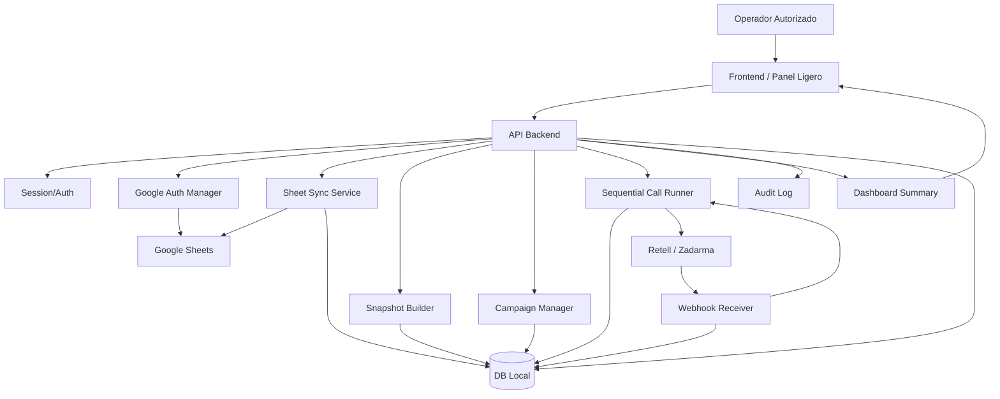

# IronPay MVP · Arquitectura de Alto Nivel (Versión Final)

## 1. Objetivo del MVP

Construir un sistema independiente que permita:

1. autenticar a operadores autorizados en el panel,
2. validar la conexión con Google Sheets,
3. copiar el contenido del Sheet a una base de datos local,
4. preparar una campaña de llamadas,
5. ejecutar llamadas secuenciales por medio del motor de llamadas,
6. mostrar un dashboard simple con estados operativos,
7. guardar trazabilidad completa de quién inició, qué snapshot se usó y qué ocurrió en cada llamada.

---

## 2. Principios del diseño

- **El frontend no toca Google directamente como fuente operativa.**
- **El Sheet es fuente de captura, no motor de ejecución.**
- **La base de datos es la verdad operativa.**
- **La campaña se ejecuta desde un snapshot congelado.**
- **Las llamadas salen una por una.**
- **La sesión del panel puede expirar sin detener el worker.**
- **El sistema debe poder reanudar si el dashboard se cierra.**
- **La autenticación del MVP tendrá una sola capa.**

---

## 3. Diagrama de alto nivel



---

## 4. Flujo de autenticación y sesión

### 4.1 Flujo oficial del MVP

```text
1. Usuario abre panel
2. Login con Google
3. Backend valida que el email esté en allowlist
4. Si coincide -> sesión activa
5. Si no coincide -> acceso denegado
```

### 4.2 Regla operativa de acceso

- Solo habrá **2 correos autorizados**.
- La allowlist estará definida **solo en código o variables de entorno**.
- **No habrá panel para administrar usuarios** en esta etapa.
- Si cambia un usuario autorizado, se modifica en código/configuración y se redeploya.

### 4.3 Ejemplo de configuración

```ts
const ALLOWED_EMAILS = [
  "operador1@tu-dominio.com",
  "operador2@tu-dominio.com",
];
```

O por variables de entorno:

```env
ALLOWED_EMAIL_1=operador1@tu-dominio.com
ALLOWED_EMAIL_2=operador2@tu-dominio.com
```

### 4.4 Regla operativa importante

- **Al iniciar el servidor no se hace sync del Sheet.**
- Al iniciar el servidor solo se hace una **validación silenciosa** del estado de Google:
  - ¿hay token?
  - ¿se puede refrescar?
  - ¿la conexión sigue viva?
- Si la validación falla, el panel debe entrar a estado `REAUTH_REQUIRED`.

### 4.5 Estados mínimos de autenticación

```text
NO_SESSION
SESSION_ACTIVE
NO_GOOGLE_AUTH
GOOGLE_CONNECTED
REAUTH_REQUIRED
ACCESS_DENIED
```

---

## 5. Lógica de usuario mínima

### 5.1 Frontend

Pantallas mínimas:

#### A. Acceso
- botón `Login con Google`
- estado: acceso concedido / acceso denegado
- mensaje claro si el correo no está autorizado

#### B. Conexión Google
- botón: `Conectar Google`
- estado: `Conectado`, `Requiere reconexión`

#### C. Validación de Sheet
- botón: `Validar Sheet`
- resultado:
  - filas totales
  - filas válidas
  - duplicadas
  - inválidas
  - versión de snapshot generado

#### D. Campaña
- botón: `Iniciar campaña`
- botón: `Pausar`
- botón: `Reanudar`

#### E. Dashboard simple
- llamadas marcadas
- llamadas pendientes
- contestó
- sin contestar
- error técnico
- terminado
- llamada actual
- última sincronización

#### F. Expiración del panel
- cierre de sesión automático por inactividad
- el worker sigue corriendo en backend

---

## 6. Lógica mínima de backend

### 6.1 Módulos mínimos

#### 1. `Session/Auth`
Responsable de:
- iniciar login con Google
- validar email contra allowlist
- crear sesión segura
- expirar sesión por tiempo o inactividad
- registrar login exitoso y login rechazado

#### 2. `GoogleAuthManager`
Responsable de:
- construir URL OAuth
- recibir callback de Google
- intercambiar `code` por tokens
- guardar refresh token cifrado
- refrescar tokens al iniciar servidor o bajo demanda
- reportar estado `connected` / `reauth_required`

#### 3. `SheetSyncService`
Responsable de:
- leer el spreadsheet autorizado
- obtener filas del rango configurado
- normalizar campos
- validar estructura
- detectar duplicados
- guardar filas raw y normalizadas

#### 4. `SnapshotBuilder`
Responsable de:
- congelar un snapshot inmutable desde el último sync válido
- asignar versión / ID de snapshot
- dejar listo el dataset para campaña

#### 5. `CampaignManager`
Responsable de:
- crear campaña desde snapshot
- validar si el snapshot es elegible
- generar `call_jobs`
- cambiar estado general de campaña

#### 6. `SequentialCallRunner`
Responsable de:
- tomar un solo job pendiente a la vez
- aplicar lock de ejecución
- llamar al proveedor
- esperar resolución del intento
- liberar el siguiente job solo cuando el anterior quede cerrado

#### 7. `WebhookReceiver`
Responsable de:
- recibir eventos del proveedor
- validar firma o secreto compartido
- deduplicar por `provider_event_id`
- actualizar intento, job y campaña
- ignorar eventos repetidos o fuera de orden si ya fueron cerrados

#### 8. `DashboardSummary`
Responsable de:
- resumir contadores operativos
- mostrar progreso de campaña
- mostrar llamada actual y errores visibles

#### 9. `AuditLog`
Responsable de:
- registrar sesiones
- registrar validaciones de Sheet
- registrar snapshots usados
- registrar campañas iniciadas/pausadas/reanudadas
- registrar outcomes por llamada

---

## 7. Máquina de estados mínima

### 7.1 Estados de campaña

```text
DRAFT
VALIDATED
RUNNING
PAUSED
COMPLETED
FAILED
```

### 7.2 Estados de call job

```text
QUEUED
LOCKED
DIALING
IN_PROGRESS
COMPLETED_SUCCESS
COMPLETED_NO_ANSWER
COMPLETED_FAILED
NEEDS_RETRY
CANCELLED
```

### 7.3 Reglas operativas mínimas

- una campaña usa un solo snapshot
- no se lee el Sheet en vivo durante campaña
- un job no puede ser tomado dos veces al mismo tiempo
- la siguiente llamada solo arranca cuando la anterior queda resuelta
- si el dashboard se cierra, la campaña sigue
- si el token Google falla, no detiene campañas ya creadas
- si el proveedor de llamadas falla, el intento queda registrado
- todo inicio de sesión, sync y campaña deja rastro en audit log

---

## 8. Idempotencia, timeouts y recovery

### 8.1 Idempotencia de webhook

Debe existir un registro `provider_events` con:

- `provider_event_id`
- `provider_call_id`
- `event_type`
- `received_at`
- `processed_at`
- `status`
- `raw_payload`

Regla:
- si un `provider_event_id` ya fue procesado, el sistema lo ignora

### 8.2 Timeouts mínimos

- TTL de lock por job
- timeout máximo de espera para cierre de llamada
- timeout del proveedor
- timeout de procesamiento de webhook

### 8.3 Recovery mínimo

Debe existir un loop o chequeo que:
- detecte jobs atrapados en `LOCKED` o `IN_PROGRESS` demasiado tiempo
- los marque para revisión o retry controlado
- registre `job_lock_recoveries_total`

---

## 9. Entidades mínimas en base de datos

### `sessions`
- id
- email
- ip
- started_at
- expires_at
- status

### `google_tokens`
- id
- provider
- access_token
- refresh_token_encrypted
- scope
- expires_at
- status

### `sheet_sync_runs`
- id
- started_at
- finished_at
- status
- rows_read_total
- rows_valid_total
- rows_invalid_total

### `snapshots`
- id
- sync_run_id
- version
- created_at
- status

### `campaigns`
- id
- snapshot_id
- started_by
- status
- started_at
- finished_at

### `call_jobs`
- id
- campaign_id
- contact_phone
- state
- lock_until
- attempt_count
- last_error

### `call_attempts`
- id
- call_job_id
- provider
- provider_call_id
- started_at
- finished_at
- outcome
- raw_response

### `provider_events`
- id
- provider_event_id
- provider_call_id
- event_type
- received_at
- processed_at
- status
- raw_payload

### `audit_logs`
- id
- actor_email
- action
- entity_type
- entity_id
- metadata
- created_at

---

## 10. Flujo operativo resumido

### 10.1 Acceso

```text
Usuario abre panel
Usuario hace Login con Google
Backend recibe callback
Backend valida email contra allowlist de 2 correos
Si está autorizado -> crea sesión
Si no está autorizado -> acceso denegado y audit log
```

### 10.2 Validación de Sheet

```text
Usuario pulsa "Validar Sheet"
Backend llama a Google Sheets API
Backend lee rango configurado
Backend normaliza filas
Backend valida campos requeridos
Backend guarda raw rows
Backend genera snapshot
Backend devuelve resumen de validación
```

### 10.3 Inicio de campaña

```text
Usuario pulsa "Iniciar campaña"
Backend crea campaign record
Backend crea call_jobs desde snapshot
Worker toma primer job pendiente
Worker manda llamada al proveedor
Proveedor responde con evento / webhook
Backend actualiza intento
Worker suelta siguiente job
```

### 10.4 Dashboard

```text
Dashboard pide /dashboard/summary cada cierto intervalo
Backend regresa contadores simples
Frontend solo pinta estado
No hay lógica pesada en frontend
```

---

## 11. Observabilidad del MVP

### 11.1 KPIs de sincronización con Google Sheets
- `last_sync_at`
- `sync_duration_ms`
- `rows_read_total`
- `rows_valid_total`
- `rows_invalid_total`
- `snapshot_version`
- `sync_status`

### 11.2 KPIs de campaña
- `campaign_status`
- `campaign_started_at`
- `campaign_finished_at`
- `contacts_total`
- `contacts_pending`
- `contacts_completed`
- `contacts_failed`
- `progress_percent`
- `current_call_job_id`

### 11.3 KPIs de ejecución de llamadas
- `calls_queued_total`
- `calls_started_total`
- `calls_finished_total`
- `calls_success_total`
- `calls_no_answer_total`
- `calls_busy_total`
- `calls_failed_total`
- `retry_total`
- `avg_call_duration_sec`
- `avg_time_to_next_call_sec`

### 11.4 KPIs de webhooks y consistencia
- `webhooks_received_total`
- `webhooks_processed_total`
- `webhooks_duplicate_total`
- `webhooks_failed_total`
- `events_out_of_order_total`
- `job_lock_recoveries_total`
- `stuck_jobs_total`

### 11.5 KPIs de infraestructura mínima
- `api_response_time_ms_p95`
- `worker_loop_latency_ms`
- `db_write_latency_ms`
- `provider_api_errors_total`
- `provider_api_timeout_total`
- `process_uptime_sec`
- `last_heartbeat_at`

### 11.6 KPIs de seguridad y acceso
- `login_success_total`
- `login_failed_total`
- `unauthorized_access_total`
- `oauth_refresh_fail_total`
- `sensitive_log_redaction_hits`

### 11.7 Capas del dashboard

#### Vista ejecutiva
- campaña actual
- progreso %
- llamadas completadas
- éxito / no contestó / error técnico
- última sincronización

#### Vista operativa
- llamada actual
- cola pendiente
- último webhook recibido
- reintentos
- jobs atorados o recuperados

#### Vista técnica
- latencia API
- errores proveedor
- timeouts
- heartbeat worker
- duplicados webhook

Regla de oro:

**Observabilidad no es tener muchas métricas; es tener pocas métricas confiables y accionables.**

---

## 12. Librerías necesarias

### 12.1 Base
- `express` — API HTTP
- `typescript` — tipado y estructura
- `dotenv` — variables de entorno
- `cors` — control de acceso frontend
- `helmet` — headers de seguridad
- `cookie-parser` — manejo de cookies de sesión
- `express-rate-limit` — limitar intentos

### 12.2 Google
- `googleapis` — OAuth y lectura de Google Sheets

### 12.3 Base de datos
#### Opción práctica
- `better-sqlite3` — SQLite local rápido y simple
- `drizzle-orm` o `knex` — acceso ordenado a DB

#### Opción crecimiento
- `postgres` + `drizzle-orm`

### 12.4 Validación y utilidades
- `zod` — validación de payloads y config
- `dayjs` — manejo de fechas
- `libphonenumber-js` — normalización de teléfonos
- `nanoid` — ids cortos

### 12.5 Llamadas y HTTP
- `axios` — llamadas HTTP a proveedor

### 12.6 Logs
- `pino` o `winston` — logging estructurado

### 12.7 Seguridad opcional pero recomendable
- sesiones con cookie firmada
- cifrado de tokens en reposo

---

## 13. Seguridad mínima obligatoria

- autenticación en una sola capa con Google OAuth
- allowlist fija de 2 correos autorizados
- cambios de correos solo desde código o configuración del backend
- refresh token cifrado en reposo
- sesiones con expiración
- logs sin PII completa por default
- teléfonos enmascarados parcialmente en dashboard
- secretos solo por variables de entorno
- webhook validado por firma o secreto compartido

### Qué no entra en este MVP
- OTP por SMS como login principal
- PIN interno adicional
- alta/baja dinámica de usuarios desde dashboard
- roles complejos
- permisos granulares

---

## 14. Riesgos técnicos mínimos

### 1. Tokens vencidos o revocados
Mitigación:
- validación silenciosa al arrancar servidor
- estado `REAUTH_REQUIRED`

### 2. Duplicidad de llamadas
Mitigación:
- lock por job
- estados transaccionales
- deduplicación de eventos webhook

### 3. Sync inválido
Mitigación:
- snapshot inmutable
- resumen de validación antes de iniciar campaña

### 4. Caída del dashboard
Mitigación:
- worker desacoplado del frontend

### 5. Ediciones del Sheet a mitad de campaña
Mitigación:
- la campaña siempre usa snapshot, nunca live sheet

### 6. Job atorado
Mitigación:
- TTL de lock
- timeout de cierre
- recovery loop

---

## 15. Sprint esperadas

| Etapa | Logros por conseguir |
|---|---|
| Etapa 1 · Base del sistema | servidor Express funcional, variables de entorno, logging base, health check, estructura de carpetas |
| Etapa 2 · Acceso al panel | login con Google, validación backend contra allowlist de 2 correos, sesión corta, expiración por inactividad, rate limit |
| Etapa 3 · Google Auth | flujo OAuth completo, callback funcionando, guardado cifrado de tokens, estado Google conectado / requiere reconexión |
| Etapa 4 · Lectura de Sheet | lectura del spreadsheet, mapeo de columnas, validación básica, resumen de filas válidas / inválidas / duplicadas |
| Etapa 5 · Snapshot a DB | persistencia de filas, creación de sync run, snapshot operativo, consulta de último sync |
| Etapa 6 · Campañas | creación de campaña desde snapshot, generación de call jobs, estados de campaña |
| Etapa 7 · Runner secuencial | tomar un solo job a la vez, locks, integración con proveedor, cierre correcto de job |
| Etapa 8 · Webhooks robustos | receiver, idempotencia, deduplicación, actualización de intentos y campañas |
| Etapa 9 · Dashboard y observabilidad | summary API, KPIs operativos, métricas técnicas mínimas, estado visible en panel |
| Etapa 10 · Hardening MVP | timeouts, recovery de jobs atorados, masking de PII, pruebas base end-to-end |

---

## 16. Conclusión ejecutiva

Este MVP debe vender una idea muy concreta:

**un operador autorizado puede conectar Google, congelar un snapshot del Sheet, ejecutar una campaña secuencial de llamadas y ver trazabilidad real en un dashboard, sin depender del Sheet live ni del panel para que la operación continúe.**

La meta no es verse enterprise.
La meta es verse:

- confiable,
- seguro para baja escala,
- demostrable frente a inversionistas,
- y expandible si la validación del negocio funciona.

---

## 17. Árbol sugerido del backend

```text
backend/
├─ src/
│  ├─ app.ts
│  ├─ server.ts
│  ├─ config/
│  │  ├─ env.ts
│  │  ├─ allowedEmails.ts
│  │  ├─ oauth.ts
│  │  └─ logger.ts
│  ├─ modules/
│  │  ├─ auth/
│  │  │  ├─ auth.controller.ts
│  │  │  ├─ auth.service.ts
│  │  │  ├─ auth.routes.ts
│  │  │  ├─ auth.types.ts
│  │  │  └─ auth.audit.ts
│  │  ├─ google/
│  │  │  ├─ googleAuth.service.ts
│  │  │  ├─ googleSheets.service.ts
│  │  │  ├─ google.routes.ts
│  │  │  └─ google.types.ts
│  │  ├─ sync/
│  │  │  ├─ sheetSync.service.ts
│  │  │  ├─ snapshotBuilder.service.ts
│  │  │  ├─ sync.routes.ts
│  │  │  ├─ sync.validator.ts
│  │  │  └─ sync.types.ts
│  │  ├─ campaigns/
│  │  │  ├─ campaign.service.ts
│  │  │  ├─ campaign.routes.ts
│  │  │  ├─ campaign.stateMachine.ts
│  │  │  └─ campaign.types.ts
│  │  ├─ calls/
│  │  │  ├─ sequentialCallRunner.service.ts
│  │  │  ├─ callJob.service.ts
│  │  │  ├─ callAttempt.service.ts
│  │  │  ├─ call.stateMachine.ts
│  │  │  └─ calls.types.ts
│  │  ├─ webhooks/
│  │  │  ├─ webhook.controller.ts
│  │  │  ├─ webhook.service.ts
│  │  │  ├─ webhook.routes.ts
│  │  │  ├─ webhook.idempotency.ts
│  │  │  └─ webhook.types.ts
│  │  ├─ dashboard/
│  │  │  ├─ dashboard.service.ts
│  │  │  ├─ dashboard.routes.ts
│  │  │  └─ dashboard.types.ts
│  │  └─ audit/
│  │     ├─ audit.service.ts
│  │     ├─ audit.types.ts
│  │     └─ audit.helpers.ts
│  ├─ providers/
│  │  ├─ callProvider.interface.ts
│  │  ├─ retell.provider.ts
│  │  └─ zadarma.provider.ts
│  ├─ db/
│  │  ├─ client.ts
│  │  ├─ schema/
│  │  │  ├─ sessions.ts
│  │  │  ├─ googleTokens.ts
│  │  │  ├─ sheetSyncRuns.ts
│  │  │  ├─ snapshots.ts
│  │  │  ├─ campaigns.ts
│  │  │  ├─ callJobs.ts
│  │  │  ├─ callAttempts.ts
│  │  │  ├─ providerEvents.ts
│  │  │  └─ auditLogs.ts
│  │  ├─ repositories/
│  │  │  ├─ sessions.repository.ts
│  │  │  ├─ googleTokens.repository.ts
│  │  │  ├─ sync.repository.ts
│  │  │  ├─ snapshots.repository.ts
│  │  │  ├─ campaigns.repository.ts
│  │  │  ├─ callJobs.repository.ts
│  │  │  ├─ callAttempts.repository.ts
│  │  │  ├─ providerEvents.repository.ts
│  │  │  └─ auditLogs.repository.ts
│  │  └─ migrations/
│  ├─ middleware/
│  │  ├─ session.middleware.ts
│  │  ├─ allowlist.middleware.ts
│  │  ├─ error.middleware.ts
│  │  ├─ rateLimit.middleware.ts
│  │  └─ requestLogger.middleware.ts
│  ├─ utils/
│  │  ├─ crypto.ts
│  │  ├─ dates.ts
│  │  ├─ phone.ts
│  │  ├─ ids.ts
│  │  └─ redact.ts
│  ├─ jobs/
│  │  ├─ worker.loop.ts
│  │  ├─ lockRecovery.job.ts
│  │  └─ heartbeat.job.ts
│  └─ tests/
│     ├─ auth.test.ts
│     ├─ sync.test.ts
│     ├─ campaigns.test.ts
│     ├─ webhooks.test.ts
│     └─ e2e.test.ts
├─ .env.example
├─ package.json
├─ tsconfig.json
└─ README.md
```

### Nota de criterio

Este árbol sigue siendo **MVP-friendly**, pero ya deja preparada una separación clara entre:

- módulos de negocio,
- proveedores externos,
- persistencia,
- middlewares,
- jobs internos,
- y utilidades.

La ventaja es que permite empezar simple sin volverte a enredar cuando el proyecto crezca.
